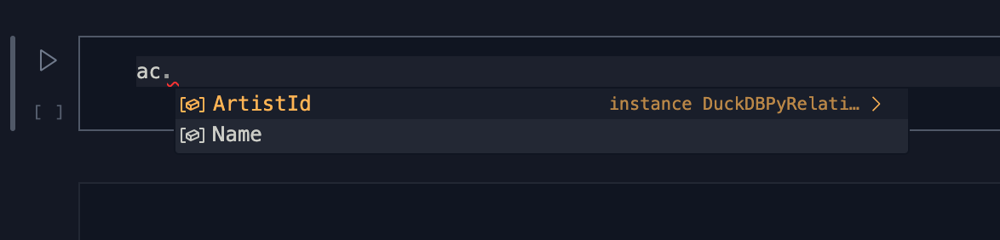

# fastduck


<!-- WARNING: THIS FILE WAS AUTOGENERATED! DO NOT EDIT! -->

`fastduck` provides some development experience improvements for the
standard `duckdb` python API.

## Install

``` sh
pip install fastduck
```

## How to use

~~import fastduck as fuck~~

``` python
from fastduck import database
```

``` python
db = database('../data/chinook.duckdb')
db
```

    DuckDBPyConnection (chinook_main)

``` python
dt = db.t
dt
```

    (chinook_main) Tables: Album, Artist, Customer, Employee, Genre, Invoice, InvoiceLine, MediaType, Playlist, PlaylistTrack, Track, fd_Customer, todos, tst

You can use this to grab a single table…

``` python
artist = dt.Artist
artist
```

    ┌──────────┬────────────────────────────────────────────────────────────────────────────────────┐
    │ ArtistId │                                        Name                                        │
    │  int32   │                                      varchar                                       │
    ├──────────┼────────────────────────────────────────────────────────────────────────────────────┤
    │        1 │ AC/DC                                                                              │
    │        2 │ Accept                                                                             │
    │        3 │ Aerosmith                                                                          │
    │        4 │ Alanis Morissette                                                                  │
    │        5 │ Alice In Chains                                                                    │
    │        6 │ Antônio Carlos Jobim                                                               │
    │        7 │ Apocalyptica                                                                       │
    │        8 │ Audioslave                                                                         │
    │        9 │ BackBeat                                                                           │
    │       10 │ Billy Cobham                                                                       │
    │        · │      ·                                                                             │
    │        · │      ·                                                                             │
    │        · │      ·                                                                             │
    │      266 │ Martin Roscoe                                                                      │
    │      267 │ Göteborgs Symfoniker & Neeme Järvi                                                 │
    │      268 │ Itzhak Perlman                                                                     │
    │      269 │ Michele Campanella                                                                 │
    │      270 │ Gerald Moore                                                                       │
    │      271 │ Mela Tenenbaum, Pro Musica Prague & Richard Kapp                                   │
    │      272 │ Emerson String Quartet                                                             │
    │      273 │ C. Monteverdi, Nigel Rogers - Chiaroscuro; London Baroque; London Cornett & Sackbu │
    │      274 │ Nash Ensemble                                                                      │
    │      275 │ Philip Glass Ensemble                                                              │
    ├──────────┴────────────────────────────────────────────────────────────────────────────────────┤
    │ 275 rows (20 shown)                                                                 2 columns │
    └───────────────────────────────────────────────────────────────────────────────────────────────┘

``` python
customer = dt['Customer']
customer
```

    ┌────────────┬───────────┬─────────────┬───┬────────────────────┬──────────────────────┬──────────────┐
    │ CustomerId │ FirstName │  LastName   │ … │        Fax         │        Email         │ SupportRepId │
    │   int32    │  varchar  │   varchar   │   │      varchar       │       varchar        │    int32     │
    ├────────────┼───────────┼─────────────┼───┼────────────────────┼──────────────────────┼──────────────┤
    │          1 │ Luís      │ Gonçalves   │ … │ +55 (12) 3923-5566 │ luisg@embraer.com.br │            3 │
    │          2 │ Leonie    │ Köhler      │ … │ NULL               │ leonekohler@surfeu…  │            5 │
    │          3 │ François  │ Tremblay    │ … │ NULL               │ ftremblay@gmail.com  │            3 │
    │          4 │ Bjørn     │ Hansen      │ … │ NULL               │ bjorn.hansen@yahoo…  │            4 │
    │          5 │ František │ Wichterlová │ … │ +420 2 4172 5555   │ frantisekw@jetbrai…  │            4 │
    │          6 │ Helena    │ Holý        │ … │ NULL               │ hholy@gmail.com      │            5 │
    │          7 │ Astrid    │ Gruber      │ … │ NULL               │ astrid.gruber@appl…  │            5 │
    │          8 │ Daan      │ Peeters     │ … │ NULL               │ daan_peeters@apple…  │            4 │
    │          9 │ Kara      │ Nielsen     │ … │ NULL               │ kara.nielsen@jubii…  │            4 │
    │         10 │ Eduardo   │ Martins     │ … │ +55 (11) 3033-4564 │ eduardo@woodstock.…  │            4 │
    │          · │    ·      │   ·         │ · │  ·                 │          ·           │            · │
    │          · │    ·      │   ·         │ · │  ·                 │          ·           │            · │
    │          · │    ·      │   ·         │ · │  ·                 │          ·           │            · │
    │         50 │ Enrique   │ Muñoz       │ … │ NULL               │ enrique_munoz@yaho…  │            5 │
    │         51 │ Joakim    │ Johansson   │ … │ NULL               │ joakim.johansson@y…  │            5 │
    │         52 │ Emma      │ Jones       │ … │ NULL               │ emma_jones@hotmail…  │            3 │
    │         53 │ Phil      │ Hughes      │ … │ NULL               │ phil.hughes@gmail.…  │            3 │
    │         54 │ Steve     │ Murray      │ … │ NULL               │ steve.murray@yahoo…  │            5 │
    │         55 │ Mark      │ Taylor      │ … │ NULL               │ mark.taylor@yahoo.au │            4 │
    │         56 │ Diego     │ Gutiérrez   │ … │ NULL               │ diego.gutierrez@ya…  │            4 │
    │         57 │ Luis      │ Rojas       │ … │ NULL               │ luisrojas@yahoo.cl   │            5 │
    │         58 │ Manoj     │ Pareek      │ … │ NULL               │ manoj.pareek@redif…  │            3 │
    │         59 │ Puja      │ Srivastava  │ … │ NULL               │ puja_srivastava@ya…  │            3 │
    ├────────────┴───────────┴─────────────┴───┴────────────────────┴──────────────────────┴──────────────┤
    │ 59 rows (20 shown)                                                             13 columns (6 shown) │
    └─────────────────────────────────────────────────────────────────────────────────────────────────────┘

… or multiple tables at once:

``` python
dt['Artist', 'Album', 'Genre']
```

    [┌──────────┬────────────────────────────────────────────────────────────────────────────────────┐
     │ ArtistId │                                        Name                                        │
     │  int32   │                                      varchar                                       │
     ├──────────┼────────────────────────────────────────────────────────────────────────────────────┤
     │        1 │ AC/DC                                                                              │
     │        2 │ Accept                                                                             │
     │        3 │ Aerosmith                                                                          │
     │        4 │ Alanis Morissette                                                                  │
     │        5 │ Alice In Chains                                                                    │
     │        6 │ Antônio Carlos Jobim                                                               │
     │        7 │ Apocalyptica                                                                       │
     │        8 │ Audioslave                                                                         │
     │        9 │ BackBeat                                                                           │
     │       10 │ Billy Cobham                                                                       │
     │        · │      ·                                                                             │
     │        · │      ·                                                                             │
     │        · │      ·                                                                             │
     │      266 │ Martin Roscoe                                                                      │
     │      267 │ Göteborgs Symfoniker & Neeme Järvi                                                 │
     │      268 │ Itzhak Perlman                                                                     │
     │      269 │ Michele Campanella                                                                 │
     │      270 │ Gerald Moore                                                                       │
     │      271 │ Mela Tenenbaum, Pro Musica Prague & Richard Kapp                                   │
     │      272 │ Emerson String Quartet                                                             │
     │      273 │ C. Monteverdi, Nigel Rogers - Chiaroscuro; London Baroque; London Cornett & Sackbu │
     │      274 │ Nash Ensemble                                                                      │
     │      275 │ Philip Glass Ensemble                                                              │
     ├──────────┴────────────────────────────────────────────────────────────────────────────────────┤
     │ 275 rows (20 shown)                                                                 2 columns │
     └───────────────────────────────────────────────────────────────────────────────────────────────┘,
     ┌─────────┬─────────────────────────────────────────────────────────────────────┬──────────┐
     │ AlbumId │                                Title                                │ ArtistId │
     │  int32  │                               varchar                               │  int32   │
     ├─────────┼─────────────────────────────────────────────────────────────────────┼──────────┤
     │       1 │ For Those About To Rock We Salute You                               │        1 │
     │       2 │ Balls to the Wall                                                   │        2 │
     │       3 │ Restless and Wild                                                   │        2 │
     │       4 │ Let There Be Rock                                                   │        1 │
     │       5 │ Big Ones                                                            │        3 │
     │       6 │ Jagged Little Pill                                                  │        4 │
     │       7 │ Facelift                                                            │        5 │
     │       8 │ Warner 25 Anos                                                      │        6 │
     │       9 │ Plays Metallica By Four Cellos                                      │        7 │
     │      10 │ Audioslave                                                          │        8 │
     │       · │     ·                                                               │        · │
     │       · │     ·                                                               │        · │
     │       · │     ·                                                               │        · │
     │     338 │ Nielsen: The Six Symphonies                                         │      267 │
     │     339 │ Great Recordings of the Century: Paganini's 24 Caprices             │      268 │
     │     340 │ Liszt - 12 Études D'Execution Transcendante                         │      269 │
     │     341 │ Great Recordings of the Century - Shubert: Schwanengesang, 4 Lieder │      270 │
     │     342 │ Locatelli: Concertos for Violin, Strings and Continuo, Vol. 3       │      271 │
     │     343 │ Respighi:Pines of Rome                                              │      226 │
     │     344 │ Schubert: The Late String Quartets & String Quintet (3 CD's)        │      272 │
     │     345 │ Monteverdi: L'Orfeo                                                 │      273 │
     │     346 │ Mozart: Chamber Music                                               │      274 │
     │     347 │ Koyaanisqatsi (Soundtrack from the Motion Picture)                  │      275 │
     ├─────────┴─────────────────────────────────────────────────────────────────────┴──────────┤
     │ 347 rows (20 shown)                                                            3 columns │
     └──────────────────────────────────────────────────────────────────────────────────────────┘,
     ┌─────────┬────────────────────┐
     │ GenreId │        Name        │
     │  int32  │      varchar       │
     ├─────────┼────────────────────┤
     │       1 │ Rock               │
     │       2 │ Jazz               │
     │       3 │ Metal              │
     │       4 │ Alternative & Punk │
     │       5 │ Rock And Roll      │
     │       6 │ Blues              │
     │       7 │ Latin              │
     │       8 │ Reggae             │
     │       9 │ Pop                │
     │      10 │ Soundtrack         │
     │       · │   ·                │
     │       · │   ·                │
     │       · │   ·                │
     │      16 │ World              │
     │      17 │ Hip Hop/Rap        │
     │      18 │ Science Fiction    │
     │      19 │ TV Shows           │
     │      20 │ Sci Fi & Fantasy   │
     │      21 │ Drama              │
     │      22 │ Comedy             │
     │      23 │ Alternative        │
     │      24 │ Classical          │
     │      25 │ Opera              │
     ├─────────┴────────────────────┤
     │      25 rows (20 shown)      │
     └──────────────────────────────┘]

It also provides auto-complete in Jupyter, IPython and nearly any other
interactive Python environment:


You can check if a table is in the database already:

``` python
'Artist' in dt
```

    True

Column work in a similar way to tables, using the `c` property:

``` python
ac = artist.c
ac, artist.columns
```

    (│
     └───────────────────────────────────────────────────────────────────────────────────────────────┘
      Columns: ArtistId, Name,
     ['ArtistId', 'Name'])

Auto-complete works for columns too:



The tables and views of a database got some interesting new attributes….

``` python
artist.meta
```

    {'base': DuckDBPyConnection (chinook_main),
     'catalog': 'chinook',
     'schema': 'main',
     'name': 'Artist',
     'type': 'BASE TABLE',
     'comment': None,
     'shape': (275, 2)}

``` python
artist.model
```

    [{'name': 'ArtistId',
      'type': 'INTEGER',
      'nullable': False,
      'default': None,
      'pk': True},
     {'name': 'Name',
      'type': 'VARCHAR',
      'nullable': True,
      'default': None,
      'pk': False}]

``` python
artist.cls, type(artist.cls)
```

    (fastduck.core.Artist, type)

`duckdb` replacement scans keep working and are wonderful for usage in
SQL statements:

``` python
db.sql("select * from artist where artist.Name like 'AC/%'")
```

    ┌──────────┬─────────┐
    │ ArtistId │  Name   │
    │  int32   │ varchar │
    ├──────────┼─────────┤
    │        1 │ AC/DC   │
    └──────────┴─────────┘

You can view the results of a query as records

``` python
db.sql("select * from artist where artist.Name like 'AC/%'").to_recs()
```

    [{'ArtistId': 1, 'Name': 'AC/DC'}]

or as a list of lists

``` python
db.sql("select * from artist where artist.Name like 'AC/%'").to_list()
```

    [[1, 'AC/DC']]

And you there is also an alias for `sql` with `to_recs` simply called
`q`

``` python
db.q("select * from artist where artist.Name like 'AC/%'")
```

    [{'ArtistId': 1, 'Name': 'AC/DC'}]

#### Dataclass support

As we briefly saw, a `dataclass` type with the names, types and defaults
of the table is added to the Relation:

``` python
abm = db.t.Album
art = db.t.Artist
acca_sql = f"""
select abm.* 
from abm join art using (ArtistID)
where art.Name like 'AC/%'
"""
acca_dacca = db.q(acca_sql)
acca_dacca
```

    [{'AlbumId': 1,
      'Title': 'For Those About To Rock We Salute You',
      'ArtistId': 1},
     {'AlbumId': 4, 'Title': 'Let There Be Rock', 'ArtistId': 1}]

``` python
let_b_rock_obj = abm.cls(**acca_dacca[-1])
let_b_rock_obj
```

    Album(AlbumId=4, Title='Let There Be Rock', ArtistId=1)

You can get the definition of the dataclass using fastcore’s
`dataclass_src` – everything is treated as nullable, in order to handle
auto-generated database values:

``` python
from fastcore.xtras import hl_md, dataclass_src

src = dataclass_src(db.t.Album.cls)
hl_md(src, 'python')
```

``` python
@dataclass
class Album:
    AlbumId: int32 = None
    Title: str = None
    ArtistId: int32 = None
```
